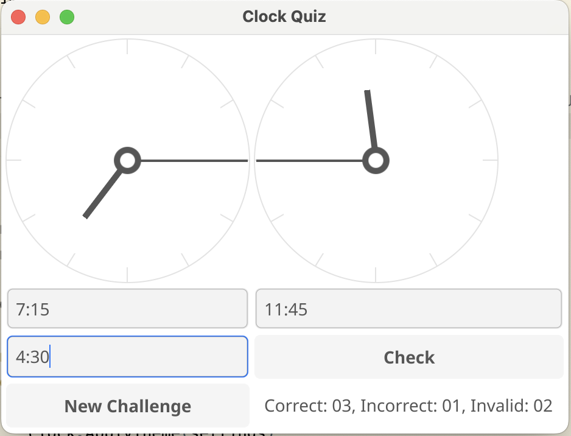

# clock-quiz

What is this? It's a basic Go app to learn the [fyne](https://fyne.io/) toolkit and to teach my daughter to 
calculate the difference in hours and minutes between two analog clocks. 

## To Do List

- write better tests
- refactor as it makes sense to do so
- fix layout to look nicer
- fix dialog box to be more consistent / good
 
## Fix macOS quarantine?

`sudo xattr -r -d com.apple.quarantine MyApp.app`
